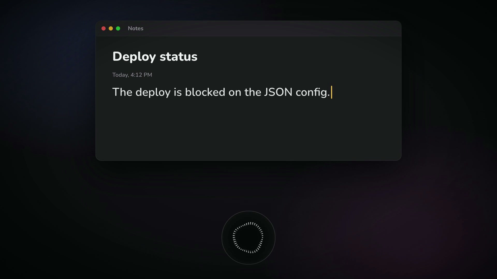

<p align="center">
  <picture>
    <source media="(prefers-color-scheme: dark)" srcset="docs/media/halo-mark-dark.svg">
    
  </picture>
</p>

<h1 align="center">Halo</h1>

**Local push-to-talk dictation for macOS.** Hold F9, speak, let go — clean
text lands at your cursor in any app.

Your audio never leaves your Mac. whisper.cpp transcribes it on-device with
Metal: 11 seconds of speech in 0.73 seconds, about 15× realtime.

[](https://github.com/tharunS123/Halo/actions/workflows/ci.yml)




```
mic -> whisper.cpp (local, Metal) -> optional cleanup -> Cmd+V into the focused app
```

## Install

```bash
brew tap tharuns123/halo
brew trust tharuns123/halo
brew install halo
halo setup
```

`brew trust` is required: Homebrew 7 refuses to load a formula from a
third-party tap until you say you trust it. Without it `brew install` stops
with "Refusing to load formula ... from untrusted tap".

`halo setup` downloads the speech model, proves it works on a sample clip, and
walks you through the three macOS permissions. Then hold **F9** anywhere.

New to Homebrew or the Terminal? [INSTALL.md](INSTALL.md) is the same thing
with every step spelled out.

Requires an Apple Silicon Mac on macOS 14+. No account needed.

## What you get

- **Push to talk.** Hold F9 in any app. No window, no menu bar icon by default
  — the key is the whole interface. Prefer a toggle? Settings offers
  press-once-to-start, press-again-to-send.
- **An orb that moves with your voice.** A dark glass pill at the bottom of
  the screen; the ribbon ripples with your mic level, so a flat band means the
  mic is not hearing you. Its size and corner are yours to pick.
- **Punctuation without a network.** Say "comma", "question mark", "new line",
  "open paren" and you get the mark. Sentence case, the pronoun *I*, filler
  removal and a closing full stop are all applied locally, so Privacy Mode and
  a key-less install read exactly as well as a cleaned one.
- **Voice commands.** Say them on their own and Halo acts instead of typing:

  | Say | What happens |
  |---|---|
  | "scratch that" | Undoes what Halo just typed |
  | "new line" / "new paragraph" | Inserts a break |
  | "privacy on" / "privacy off" | Stops or resumes sending text for cleanup |
  | "hey halo, make that shorter" | Rewrites Halo's last output |

- **Snippets.** Say "my email signature", get the stored text pasted verbatim
  — never leaves your machine.
- **A dictionary** for words whisper mishears, including your own name. It is
  also fed to whisper *before* it decodes, so your terms are likelier to come
  out right in the first place rather than being corrected afterwards.
- **A Settings window** — `halo settings`, or an optional menu bar item — for
  all of the above, plus editing that dictionary and adding your OpenRouter
  key without touching JSON or Terminal.
- **Privacy Mode**, persistent across restarts, with a lock badge on the orb
  while you speak so the guarantee is visible.

## Privacy

- **Audio: never leaves your Mac.** Recording and transcription are local.
- **Transcript text: only if you add an API key.** The optional cleanup pass
  sends the text (never the audio) to OpenRouter for a final tidy. Without a
  key Halo runs fully offline — and since 0.3.2 punctuation, capitalization
  and filler removal are local, so going offline no longer costs you them.
- **"privacy on"** stops even that, instantly and persistently.
- No telemetry, no analytics, no account.

If you do use a key, note that OpenRouter's free models require allowing data
retention and training in your account settings, so those transcripts may be
retained by the provider. `halo setup` says so before asking.

To add a key after setup, paste it into Settings › Privacy (`halo settings`),
or run `halo key set`. It is kept in your Keychain, never in a config file.
[INSTALL.md](INSTALL.md#adding-an-openrouter-key-later) lists the two
OpenRouter settings free models need.

## Configuration

Your settings live in `~/.config/halo/` and survive upgrades.

```bash
halo settings            # the window: hotkey, orb, dictation, vocabulary, privacy
halo config              # every setting, and where its value came from
halo config edit         # open settings.json
halo config set hotkey f12
```

Everything reloads while Halo runs. The engine checks for changes once a
second, so a setting applies to the next thing you say after that — no
restart either way. A hotkey change rebinds as soon as dictation is idle,
never mid-utterance.

| File | Contents |
|---|---|
| `settings.json` | hotkey, activation style, language, model, orb, local formatting, cleanup |
| `dictionary.json` | words whisper mishears — add your name first |
| `snippets.json` | spoken triggers that expand to stored text |
| `commands.json` | phrases for the voice commands above |

The window and the CLI write the same files, so neither is the "real" one.

## Troubleshooting

```bash
halo doctor     # checks everything and names the fix
halo status     # what is running, and its permissions
halo logs       # what the engine actually did
```

| Symptom | Cause |
|---|---|
| F9 does nothing | Accessibility off, or the engine is not running |
| Every transcript is empty (`peak 0.000` in the log) | The Microphone prompt was missed — macOS hands out silence, not an error |
| Worked until you updated | Updating the app voids its permissions; `halo doctor` detects it |
| Spoken "period" typed as a word | It only counts as a command at the end of an utterance — "the Jurassic period was long" is left alone on purpose |
| Your vocabulary pasted at the cursor | A silent clip made whisper echo its own priming prompt; turn off Settings › Dictation › Prime whisper |

There is no paid Apple Developer ID here, so `halo setup` offers to sign Halo
with a certificate generated on your Mac. Say yes and your permissions survive
upgrades: macOS keys the grant to the certificate rather than to the bundle's
contents. The certificate never leaves your machine and needs no password or
admin rights.

Decline, and Halo stays ad-hoc — the code hash *is* the identity, and since
the version string lives inside the bundle, every release then costs one
re-grant. `halo doctor` says which mode you are in, and `halo setup --repair`
walks the re-grant when there is one. [ARCHITECTURE.md](ARCHITECTURE.md)
explains the whole permission model, and why this still beats shipping a
downloadable app.

## Uninstall

```bash
halo uninstall          # add --purge to remove settings and models too
brew uninstall halo
```

## Documentation

- [INSTALL.md](INSTALL.md) — step-by-step install for a fresh Mac
- [ARCHITECTURE.md](ARCHITECTURE.md) — how it works and why, including the
  macOS permission model and the measurements behind the tuning
- [CONTRIBUTING.md](CONTRIBUTING.md) — running from a checkout, tests, releases
- [CHANGELOG.md](CHANGELOG.md) — what changed, and what needs your hands after
  an upgrade

## Credits

- [whisper.cpp](https://github.com/ggml-org/whisper.cpp) (MIT) — on-device
  transcription
- [Orb](https://libraries.dev/orbs.html) by Jakub Antalik (MIT) — the orb
  animation, vendored in `overlay/Sources/ThinkingOrbsKit/`
- [pynput](https://github.com/moses-palmer/pynput) (LGPL-3.0) — the global
  hotkey and synthetic keystrokes

Halo itself is MIT licensed — see [LICENSE](LICENSE).
