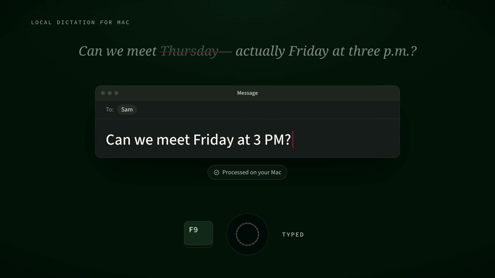

<p align="center">
  
</p>

<h1 align="center">
  <picture>
    <source media="(prefers-color-scheme: dark)" srcset="overlay/Resources/Brand/halo-wordmark-white.svg">
    
  </picture>
</h1>

**Local push-to-talk dictation for macOS.** Hold F9, speak, let go — clean
text lands at your cursor in any app.

Nothing you say leaves your Mac — not the audio, not the text. whisper.cpp
transcribes on-device with Metal (11 seconds of speech in 0.73 seconds, about
15× realtime), cleanup runs on-device too, and Halo works with Wi-Fi off.

[](https://github.com/tharunS123/Halo/actions/workflows/ci.yml)




```
mic -> whisper.cpp (local, Metal) -> cleanup (rules, then an optional local model) -> verified insertion into the app you started in
```

## Install

```bash
brew tap tharuns123/halo
brew trust tharuns123/halo
brew install halo
halo setup
```

`brew trust` is required: Homebrew 7 refuses to load a formula from a
third-party tap until you say you trust it. Without it `brew install` stops
with "Refusing to load formula ... from untrusted tap".

`halo setup` installs Halo and opens its setup guide: privacy, the two macOS
permissions, your microphone, a speech model, your language, your shortcut,
and a real test dictation. Then hold **F9** anywhere. (Prefer Terminal? `halo
setup --cli`.)

New to Homebrew or the Terminal? [INSTALL.md](INSTALL.md) is the same thing
with every step spelled out.

Requires an Apple Silicon Mac on macOS 14+. No account needed.

## What you get

- **Push to talk.** Hold F9 in any app. No window, no menu bar icon by default
  — the key is the whole interface. Prefer a toggle? Settings offers
  press-once-to-start, press-again-to-send.
- **An orb that moves with your voice.** A small Night glass bubble at the
  bottom of the screen, ringed by an Imperial glow. The dotted orb inside
  ripples with your mic level, so a calm orb while you talk means the mic is
  not hearing you. Short labels beside it name Command Mode, the language,
  privacy and errors. Its size and corner are yours to pick.
- **Punctuation without a network.** Say "comma", "question mark", "new line",
  "open paren" and you get the mark. Sentence case, the pronoun *I*, filler
  removal and a closing full stop are all applied locally, with no model and
  no network.
- **Cleanup you can dial.** Off, Verbatim, Light, Normal or Polished. Normal
  fixes self-corrections — "meet me Thursday — actually Friday" types *Meet
  me Friday.* — turns "number one … number two" into a list, and writes
  numbers, dates, times, money, phone numbers, emails and links the way you
  would type them. All of that is local rules, well under a millisecond.
- **An optional language model on your Mac.** `halo model local install`
  downloads a 1.1 GB model that llama.cpp runs on the GPU, adding grammar
  repair in 0.1–0.5 s. Polished mode lets it reword for readability. It is
  checked so it can never add a name, number or address you did not say, and
  if it is missing, loading, slow or wrong you get the rule-based text — a
  dictation is never lost to it.
- **Context Awareness.** Halo looks at the app you are dictating into and a
  little text around the cursor: no full stop on a short Slack reply, a
  greeting on its own line in Mail, no capital when you dictate into the
  middle of a sentence, names spelled the way the thread spells them. Held in
  memory for one dictation, never read from password fields, never logged or
  saved, and one switch turns it off.
- **Styles per app.** Casual in Messages, concise in Slack, professional in
  Mail, exact in your editor — or your own style, written in plain English.
- **Command Mode.** Hold Shift with the key, select some text, and say "make
  this shorter", "fix the grammar" or "replace John with Sarah". The orb
  turns violet; nothing is replaced until the result is ready.
- **Developer Mode** in editors and terminals: "camel case user id" →
  `userId`, "dash dash dry dash run" → `--dry-run`, "config dot json" →
  `config.json`, and Supabase, SwiftUI and async/await spelled right.
- **Voice commands.** Say them on their own and Halo acts instead of typing:

  | Say | What happens |
  |---|---|
  | "scratch that" | Removes what Halo just typed — only Halo's text, never yours |
  | "new line" / "new paragraph" | Inserts a break |
  | "switch to Spanish" | Changes the dictation language |
  | "privacy on" / "privacy off" | Stops or resumes History, cursor context and vocabulary learning |
  | "hey halo, make that shorter" | Rewrites Halo's last output |

  **Escape** cancels at any stage — while recording, transcribing or cleaning up.
- **Types only where you started.** If you switch apps while Halo is
  working, it does not type into the new one. And when it has to borrow the
  clipboard, everything you had copied — images and files too — comes back.

- **Snippets.** Say "my email signature", get the stored text pasted verbatim
  — never leaves your machine.
- **A dictionary** for words whisper mishears, including your own name — with
  types, pronunciation hints, per-app or per-language entries, and import and
  export. It is also fed to whisper *before* it decodes. When you fix a word
  Halo typed, it offers to learn it (never without your click).
- **History, if you want it** — off by default, kept only on this Mac, with
  search, copy, reinsert and retry, and a retention you choose.
- **A Settings window** — `halo settings`, or an optional menu bar item — for
  all of the above: microphone with a live meter, models with one-click
  download and checksum verification, languages, launch at login,
  permissions and engine health.
- **Privacy Mode** for a dictation you want no trace of: no History, no
  reading around the cursor, no learning. Persistent across restarts, with a
  lock badge on the orb while you speak.
- **Nothing is lost when something fails.** If whisper, cleanup or the
  insertion fails — or you switch apps mid-dictation — the recording and the
  text are kept for 30 minutes: retry transcription, cleanup or insertion,
  copy or discard, from Settings › History or the menu bar.

## Privacy

- **Audio and text: never leave your Mac.** Recording, transcription,
  cleanup, Command Mode and transforms all run on this Mac. There is no cloud
  provider to switch on: the engine refuses every network connection that
  would leave the machine, and the test suite runs the whole workflow with the
  network blocked to prove it.
- **What is on your screen: never leaves your Mac either.** Context Awareness
  reads a few hundred characters around the cursor into memory for one
  dictation. It skips password and other secure fields entirely, and is never
  written to a log or to disk.
- **"privacy on"** stops even that, and keeps no History, instantly and
  persistently.
- **History is off by default**, and when on it never keeps password-field
  dictation or the text around your cursor. Audio is a separate switch.
- **Logs never contain what you said** — only how long it was.
- No telemetry, no analytics, no account, no API key.

The network is used only when you ask Halo to download a model, by a
separate `halo model` process — never by the engine that hears you.

Upgrading from 0.3 with an OpenRouter key? Halo no longer uses it.
`halo key delete` (or Settings › Privacy) removes it from your Keychain.

## Configuration

Your settings live in `~/.config/halo/` and survive upgrades.

```bash
halo settings            # the window: hotkey, orb, dictation, vocabulary, privacy
halo settings models     # ...opened straight to a section
halo dictionary export --format csv words.csv
halo model local install # the optional cleanup model on this Mac
halo config              # every setting, and where its value came from
halo config edit         # open settings.json
halo config set hotkey f12
```

Everything reloads while Halo runs. The engine checks for changes once a
second, so a setting applies to the next thing you say after that — no
restart either way. A hotkey change rebinds as soon as dictation is idle,
never mid-utterance.

| File | Contents |
|---|---|
| `settings.json` | hotkey, activation, languages, microphone, orb, cleanup, context, history, Command Mode |
| `styles.json` | style per kind of app, per-app overrides, your custom styles |
| `transforms.json` | your custom Command Mode transforms |
| `dictionary.json` | words whisper mishears — add your name first |
| `snippets.json` | spoken triggers that expand to stored text |
| `commands.json` | phrases for the voice commands above |

The window and the CLI write the same files, so neither is the "real" one.

## Troubleshooting

```bash
halo doctor     # checks everything and names the fix
halo status     # what is running, and its permissions
halo logs       # what the engine actually did
```

| Symptom | Cause |
|---|---|
| F9 does nothing | Accessibility off, or the engine is not running |
| Every transcript is empty (`peak 0.000` in the log) | The Microphone prompt was missed — macOS hands out silence, not an error |
| Worked until you updated | Updating the app voids its permissions; `halo doctor` detects it |
| Spoken "period" typed as a word | It only counts as a command at the end of an utterance — "the Jurassic period was long" is left alone on purpose |
| A spoken correction was left in | Only a pause-marked correction counts ("Thursday, actually Friday") — "I actually like it" is left alone on purpose. Without a local model, genuinely ambiguous ones are left as spoken |
| No full stop in Slack or Messages | Short chat replies skip it; Settings › Dictation › End short chat messages with a full stop |
| Your vocabulary pasted at the cursor | A silent clip made whisper echo its own priming prompt; turn off Settings › Dictation › Prime whisper |

There is no paid Apple Developer ID here, so `halo setup` offers to sign Halo
with a certificate generated on your Mac. Say yes and your permissions survive
upgrades: macOS keys the grant to the certificate rather than to the bundle's
contents. The certificate never leaves your machine and needs no password or
admin rights.

Decline, and Halo stays ad-hoc — the code hash *is* the identity, and since
the version string lives inside the bundle, every release then costs one
re-grant. `halo doctor` says which mode you are in, and `halo setup --repair`
walks the re-grant when there is one. [ARCHITECTURE.md](ARCHITECTURE.md)
explains the whole permission model, and why this still beats shipping a
downloadable app.

## Uninstall

```bash
halo uninstall          # add --purge to remove settings and models too
brew uninstall halo
```

## Documentation

- [INSTALL.md](INSTALL.md) — step-by-step install for a fresh Mac
- [ARCHITECTURE.md](ARCHITECTURE.md) — how it works and why, including the
  macOS permission model and the measurements behind the tuning
- [CONTRIBUTING.md](CONTRIBUTING.md) — running from a checkout, tests, releases
- [CHANGELOG.md](CHANGELOG.md) — what changed, and what needs your hands after
  an upgrade

## Credits

- [whisper.cpp](https://github.com/ggml-org/whisper.cpp) (MIT) — on-device
  transcription
- [llama.cpp](https://github.com/ggml-org/llama.cpp) (MIT) — the optional
  local cleanup model; [Qwen](https://huggingface.co/Qwen) models (Apache 2.0)
- [Orb](https://libraries.dev/orbs.html) by Jakub Antalik (MIT) — the orb
  animation, vendored in `overlay/Sources/ThinkingOrbsKit/`
- [Border Beam](https://libraries.dev/beam) by Jakub Antalik (MIT) — the
  glow around the orb, vendored in `overlay/Sources/BorderBeamKit/`
- [Oswald](https://fonts.google.com/specimen/Oswald),
  [Source Sans 3](https://fonts.google.com/specimen/Source+Sans+3),
  [Source Code Pro](https://fonts.google.com/specimen/Source+Code+Pro),
  [Noto Serif](https://fonts.google.com/noto/specimen/Noto+Serif) and, in the
  wordmark, [Archivo Black](https://fonts.google.com/specimen/Archivo+Black)
  (all SIL OFL 1.1) — licenses in `overlay/Resources/Licenses/`
- [pynput](https://github.com/moses-palmer/pynput) (LGPL-3.0) — the global
  hotkey and synthetic keystrokes

Halo itself is MIT licensed — see [LICENSE](LICENSE).
